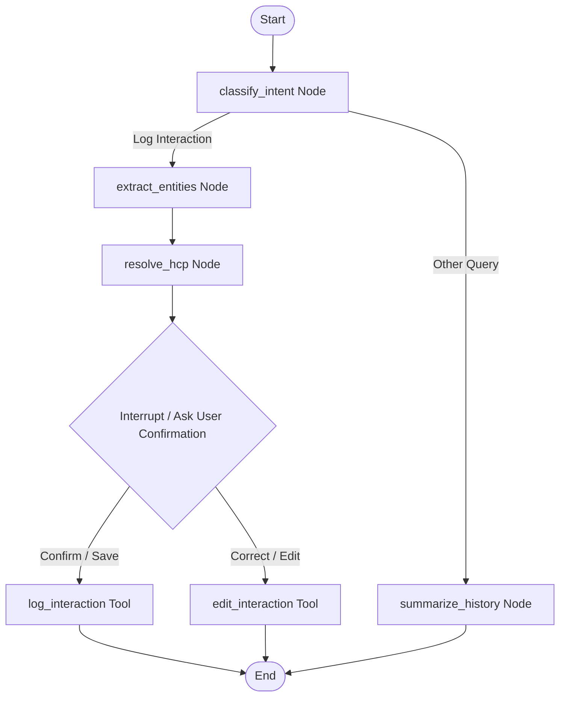

# AI-First CRM: HCP Log Interaction Screen

An intelligent, stateful CRM logging dashboard designed for pharmaceutical field representatives ("reps"). Reps can log interactions either by filling out a structured form or by describing the visit in natural language to a chat assistant. The conversational pipeline uses a stateful **LangGraph** agent flow to extract entities, fuzzy-match doctors, propose interactive preview cards, support inline corrections, and write detailed audit histories.

---

## 🚀 Key Features

* **Dual-Mode Entry**: Instantly toggle between **AI Chat Assistant** and **Structured Form** inputs.
* **Stateful LangGraph Assistant**: Multi-turn dialogue flow which performs:
  * Intent Classification & Entity Extraction
  * Search/Fuzzy-matching of Doctors (HCPs)
  * Human-in-the-loop interrupts presenting a draft preview card
  * Persistent tool calls on user confirmation
* **Searchable Dropdowns**: Seamless search and selection of Healthcare Professionals (HCPs) matching the PRD specifications.
* **Inline Draft Corrections**: Reps can tweak fields, add product discussions, or select sample quantities directly inside the chat bubbles before final submission.
* **Comprehensive Audit Trail**: Track every interaction edit, including change summaries, values, author, extraction source (AI vs Manual), and extraction confidence.
* **Dark / Light Modes**: Persistent settings allowing users to switch between **Midnight Obsidian** (dark mode) and **Clinical Slate** (light mode).

---

## 🛠️ Technology Stack

* **Frontend**: React 18, Redux Toolkit, Vanilla CSS (Obsidian design tokens), Lucide Icons, Vite
* **Backend API**: Python 3.11, FastAPI, Uvicorn, SQLAlchemy 2.0, Alembic migrations, OAuth2 Bearer security
* **AI Orchestration**: LangGraph, Groq API (fallback to local regex parsing & mock models if keys are missing)
* **Database**: PostgreSQL (Dockerized) or SQLite (local development `hcp_crm.db`)

---

## 📂 Repository Structure

```text
ai-crm-hcp-module/
├── README.md                  # Root documentation
├── docker-compose.yml         # Container configuration
├── backend/
│   ├── Dockerfile
│   ├── requirements.txt
│   ├── seed.py                # Database seeding script
│   ├── alembic.ini            # Alembic configuration
│   ├── app/
│   │   ├── main.py            # FastAPI entry point
│   │   ├── config.py          # Settings and credentials loader
│   │   ├── db/
│   │   │   ├── models.py      # SQLAlchemy relational models
│   │   │   ├── session.py     # Database engine & sessions
│   │   │   └── migrations/    # Alembic migrations directory
│   │   ├── schemas/           # Pydantic schemas (hcp, interaction, chat)
│   │   ├── api/               # FastAPI routers (auth, hcps, interactions, chat)
│   │   └── agent/             # LangGraph agent definitions
│   │       ├── graph.py       # Compiled StateGraph & fallback parsers
│   │       ├── state.py       # AgentState definition
│   │       ├── llm.py         # Model wrappers (Groq/Gemini)
│   │       └── tools/         # StateGraph tools (log, edit, schedule, search)
├── frontend/
│   ├── Dockerfile
│   ├── package.json
│   ├── src/
│   │   ├── main.jsx
│   │   ├── App.jsx
│   │   ├── index.css          # Design system & theme tokens
│   │   ├── app/
│   │   │   └── store.js       # Combined Redux store
│   │   ├── features/          # Redux slices (chat, interactions)
│   │   ├── pages/
│   │   │   └── LogInteractionScreen.jsx # Layout dashboard
```

---

## 🎯 LangGraph Agent State Machine Routing

The conversational flow operates on the following graph topology:


---

## 🔧 Setup & Running

### Option 1: Docker Compose (Fully Containerized)
From the root directory:
```bash
docker-compose up --build
```
* **Frontend Dashboard**: `http://localhost:5173/`
* **FastAPI Docs**: `http://localhost:8000/docs`

### Option 2: Local Development Setup

#### Backend Setup
1. Navigate to backend directory:
   ```bash
   cd backend
   ```
2. Create and activate a virtual environment:
   ```bash
   python -m venv .venv
   .venv\Scripts\activate
   ```
3. Install dependencies:
   ```bash
   pip install -r requirements.txt
   ```
4. Run migrations & seed DB:
   ```bash
   alembic upgrade head
   python seed.py
   ```
5. Launch FastAPI server:
   ```bash
   uvicorn app.main:app --reload --port 8000
   ```

#### Frontend Setup
1. Navigate to frontend directory:
   ```bash
   cd ../frontend
   ```
2. Install packages:
   ```bash
   npm install
   ```
3. Launch development server:
   ```bash
   npm run dev
   ```
